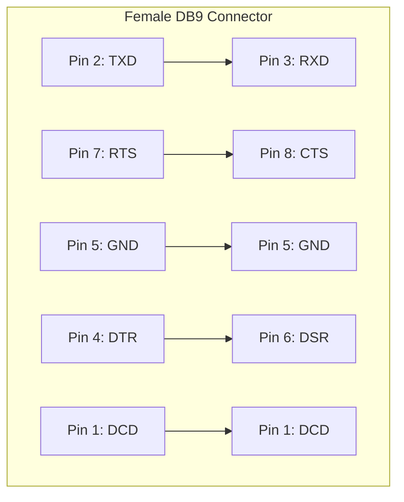

# VARIOUS NOTES

##  USE CTS/RTS

```bas
 100 REM ** Receive Test **
 110 REM ** Use RTS/CTS **
 120 CLS
 130 FORMAT "p";9600
 140 OPEN #4,"p"
 150 PRINT INKEY$#4;
 160 GO TO 150
```

On 48k with interface 1 FORMAT "b";9600 Then , the spectrum works in 8bit data at 9600 bauds.

https://github.com/ruyrybeyro/zxtrans/tree/main

 A Data RS232 cable uses RTS/CTS handshaking to ensure reliable data transfers and so removes the necessity for a PC application to explicitly control the DTR line. This configuration is therefore more appropriate if the cable is also to be used for connecting to standard PC applications and guaranteed data transfers are required (if the PC application is capable of buffering as much data as is sent to it then the Serial Printer cable will be equally suitable).

The tables below show the Data cable wiring appropriate for the different types of RS232 sockets:
Pin	Name		PC-9	PC-25	Name
1	0V		5	7	0V
2	TXD		3	2	TXD
3	RXD		2	3	RXD
4	DTR		7	4	RTS
5	CTS		8	5	CTS
6	12V		6	6	DSR
6	12V		1	8	DCD
		
Pin	Name		PC-9	PC-25	Name
1	0V		5	7	0V
2	CTS		8	5	CTS
3	DTR		7	4	RTS
4	RXD		2	3	RXD
5	TXD		3	2	TXD
6	12V		6	6	DSR
6	12V		1	8	DCD
		
Pin	Name		PC-9	PC-25	Name
2	TX		3	2	TXD
3	RX		2	3	RXD
4	DTR		7	4	RTS
5	CTS		8	5	CTS
7	0V		5	7	0V
9	9V		6	6	DSR
9	9V		1	8	DCD
Spectrum 128 RS232 		Spectrum 128 Keypad 		ZX Interface 1 RS232

For the Spectrum 128 RS232 and Keypad sockets, pin 6 is at the side with the clip. Further details can be found in the topic describing the Spectrum 128 Keypad.

Serial Printer Cable
	

A Serial Printer RS232 cable is primarily intended to allow the Spectrum to control a printer fitted with a serial interface, but can also be used to transmit data to a PC. The ZX Tape Player utility has been written to control the DTR signal line such that reliable data transfers from the Spectrum are achieved using a Serial Printer cable.

The tables below show the Serial Printer cable wiring appropriate for the different types of RS232 sockets:
Pin	Name		PC-9	PC-25	Name
1	0V		5	7	0V
2	TXD		3	2	TXD
3	RXD		2	3	RXD
4	DTR		4	20	DTR
5	CTS		8	5	CTS
6	12V		6	6	DSR
		
Pin	Name		PC-9	PC-25	Name
1	0V		5	7	0V
2	CTS		8	5	CTS
3	DTR		4	20	DTR
4	RXD		2	3	RXD
5	TXD		3	2	TXD
6	12V		6	6	DSR
		
Pin	Name		PC-9	PC-25	Name
2	TX		3	2	TXD
3	RX		2	3	RXD
4	DTR		4	20	DTR
5	CTS		8	5	CTS
7	0V		5	7	0V
9	9V		6	6	DSR
Spectrum 128 RS232 		Spectrum 128 Keypad 		ZX Interface 1 RS232

http://www.fruitcake.plus.com/Sinclair/Interface2/Cartridges/Interface2_RC_New_RS232.htm



